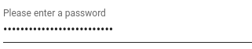
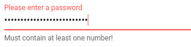

# vvapp
> A python library simplifying ipyvuetify voila application building.


## Install

`pip install vvapp`

## Inputs

`vvapp` is meant to be used in Jupyter, so launching jupyter first (`$jupyter notebook`).

There are a few key things to keep in mind when getting up and running with `vvapp`:

* `v_model`
    * The value of `vvapp` inputs is set and accessed via the `v_model` attribute, following the `ipyvuetify` convention
* `class_`
    * This is where you put `vuetify.js` class properties, like `ma-4` to add margins around the input
* `style_`
    * This is where you can add CSS to your elements
* `hint`
    * The `hint` can be a string *or* a callable to provide input validation
    * If `hint` is a callable, it must return a string or None; if it returns a string, the input is marked as invalid and the string is displayed
        

```
from vvapp.inputs import __all__ as available_input_widgets
available_input_widgets
```


    ['password']


### password

```
from vvapp.inputs import password
pw = password(label='Please enter a password',v_model='correcthorsebatterystapler')
pw
```




The value of of a vvapp widget is set/accessed by the `v_model` attribute, just like in ipyvuetify

```
pw.v_model
```


    'correcthorsebatterystapler'


Here we demonstrate the use of a function to validate the value of the input.

In this example the password must be at least 12 characters, less than 64 characters and include at least one number:

```
import re
def validate_pw(widget_value):
    if widget_value is None:
        return 'Input must not be None'

    else:
        if len(widget_value) < 12:
            return 'Too Short!'

        if len(widget_value) > 64:
            return 'Too Long!'

        if not re.search('[0-9]+',widget_value):
            return 'Must contain at least one number!'

    return None

pw = password(label='Please enter a password',v_model='correcthorsebatterystapler', hint=validate_pw)
pw
```


