# vvapp
> A python library simplifying ipyvuetify voila application building.


## Documentation

https://radinplaid.github.io/vvapp/

## Install

`pip install vvapp`

## Inputs

`vvapp` is meant to be used in Jupyter, so launching jupyter first (`$jupyter notebook`).

There are a few key things to keep in mind when getting up and running with `vvapp`:

* `v_model`
    * The value of `vvapp` inputs is set and accessed via the `v_model` attribute, following the `ipyvuetify` convention
* `class_`
    * This is where you put `vuetify.js` class properties, like `ma-4` to add margins around the input
* `style_`
    * This is where you can add CSS to your elements
* `hint`
    * The `hint` can be a string *or* a callable to provide input validation
    * If `hint` is a callable, it must return a string or None; if it returns a string, the input is marked as invalid and the string is displayed
        

```
from vvapp.inputs import __all__ as available_input_widgets
available_input_widgets
```


    ['checkbox', 'password', 'time', 'date', 'number', 'slider', 'radio_buttons']


### select (dropdown)

For a select input, the `v_model` can be a list:

```
from vvapp.inputs import select
select(items=['one','two','three'],v_model='two')
```

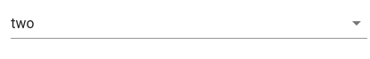

... or a dict where the keys are the labels to be displayed and the values and the values

```
select(items={'One':'one','Two':'two','Three':'three'},v_model='two')
```

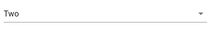

Also, it is possible for multiple items to be selected via the `multiple` prop:

```
tmp = select(items={'One':'one','Two':'two','Three':'three'},v_model=['one','two'],multiple=True)
tmp
```

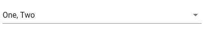

```
tmp.v_model
```


    ['one', 'two']


### combobox

### checkbox

```
from vvapp.inputs import checkbox
checkbox(label='Checkbox example',v_model=True)
```

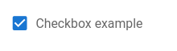

### slider

```
from vvapp.inputs import slider
slider(label='Slider Example',
       min=0,
       max=10,
       step=1,
       color='red',
       track_color='red',
       v_model=5)
```

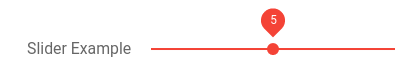

### range_slider

```
from vvapp.inputs import range_slider
range_slider(min=0,max=100,v_model=[40,60])
```

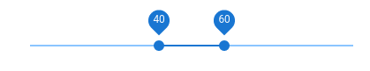

### radio_buttons

```
from vvapp.inputs import radio_buttons
radio_buttons(choices={
                    'Apple': 'apple',
                    'Blueberry': 'blueberry',
                    'Pumpkin': 'pumpkin'
                },
              label='What is your favourite pie flavour?',
              v_model='blueberry')
```

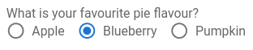

### date

```
from vvapp.inputs import date
date(label='Please enter a date (format: YYYY-mm-dd)',
     v_model='2020-04-15',
     style_='max-width:320px')
```

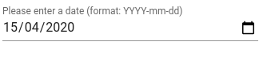

### time

```
from vvapp.inputs import time
time(label='Please enter a time (format: HH:MM)',
     v_model='13:34',
     style_='max-width:320px')
```


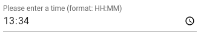


### number

```
from vvapp.inputs import number
number(placeholder='Enter a number',
     style_='max-width:320px')
```

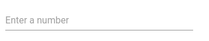


`number` inputs have a default validation function that changes the `error` state of the input to True and prints a sensible hint if the value is less than `min_value` or greater than `max_value`

```
from vvapp.inputs import number
number(label='Number Input',
       v_model=123,
       min_value=0,
       max_value=100,
     style_='max-width:320px')
```


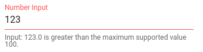


### password

```
from vvapp.inputs import password
pw = password(label='Please enter a password',v_model='correcthorsebatterystapler')
pw
```

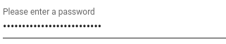


The value of of a vvapp widget is set/accessed by the `v_model` attribute, just like in ipyvuetify

```
pw.v_model
```


    'correcthorsebatterystapler'


Here we demonstrate the use of a function to validate the value of the input.

In this example the password must be at least 12 characters, less than 64 characters and include at least one number:

```
import re
def validate_pw(widget_value):
    if widget_value is None:
        return 'Input must not be None'

    else:
        if len(widget_value) < 12:
            return 'Too Short!'

        if len(widget_value) > 64:
            return 'Too Long!'

        if not re.search('[0-9]+',widget_value):
            return 'Must contain at least one number!'

    return None

pw = password(label='Please enter a password',v_model='correcthorsebatterystapler', hint=validate_pw)
pw
```

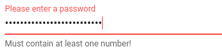


## Outputs

### PandasTable

```
import pandas as pd
from vvapp.outputs import PandasTable
df = pd.DataFrame({'a':[1,2,3],'b':[2,3,4]})
PandasTable(data=df,title='My DataFrame')
```

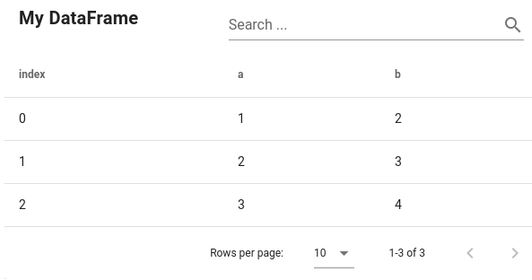


The pandas DataFrame output has a nice warning/error display if the search returns zero results or if are no rows in the PandasDataframe:

```
import pandas as pd
from vvapp.outputs import PandasTable
df = pd.DataFrame({'a':[1,2,3],'b':[2,3,4]})
PandasTable(data=df,title='My DataFrame')
```

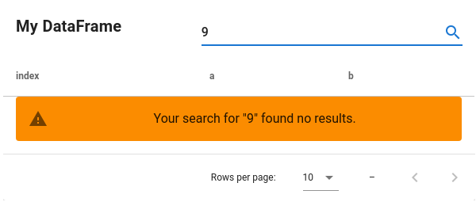


```
import pandas as pd
from vvapp.outputs import PandasTable
PandasTable(data=pd.DataFrame(),title='My DataFrame')
```

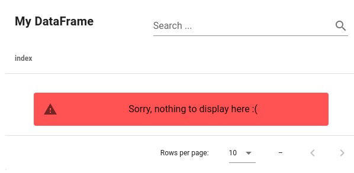


### Markdown

```
from vvapp.outputs import markdown 

markdown("""
# Markdown Title

## Markdown Subtitle

Some body text

* a list element
* another list element
""")
```

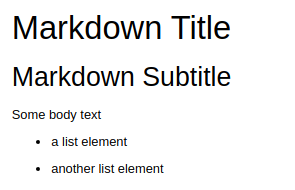

