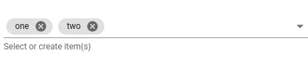
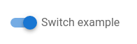
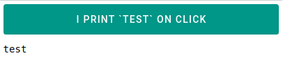
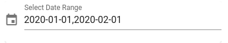
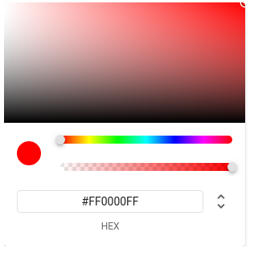
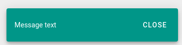
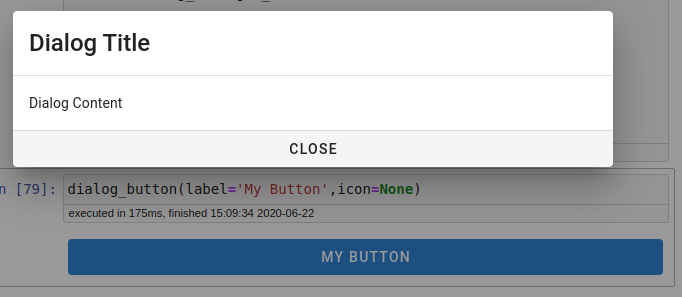
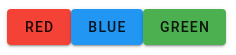
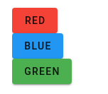
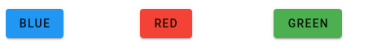

# vvapp
> A python library simplifying ipyvuetify voila application building.


## Documentation

https://radinplaid.github.io/vvapp/

## Install

`pip install vvapp`

## Inputs

`vvapp` is meant to be used in Jupyter, so launching jupyter first (`$jupyter notebook`).

There are a few key things to keep in mind when getting up and running with `vvapp`:

* `v_model`
    * The value of `vvapp` inputs is set and accessed via the `v_model` attribute, following the `ipyvuetify` convention
* `class_`
    * This is where you put `vuetify.js` class properties, like `ma-4` to add margins around the input
* `style_`
    * This is where you can add CSS to your elements
* `hint`
    * The `hint` can be a string *or* a callable to provide input validation
    * If `hint` is a callable, it must return a string or None; if it returns a string, the input is marked as invalid and the string is displayed
        

```
from vvapp.inputs import __all__ as available_input_widgets
available_input_widgets
```


    ['input_switch',
     'input_checkbox',
     'input_text',
     'input_password',
     'input_time',
     'input_date',
     'input_daterange',
     'input_number',
     'input_range_slider',
     'input_slider',
     'input_radio_buttons',
     'input_select',
     'input_select_or_create',
     'input_button',
     'input_color_picker']


```
from vvapp.inputs import *
```

### text

```
input_text(label='Text Input',hint='Enter some text',v_model='some text')
```


### select (dropdown)

For a select input, the `v_model` can be a list:

```
input_select(items=['one','two','three'],v_model='two')
```


... or a dict where the keys are the labels to be displayed and the values and the values

```
input_select(items={'One':'one','Two':'two','Three':'three'},v_model='two')
```


Also, it is possible for multiple items to be selected via the `multiple` prop:

```
tmp = input_select(items={'One':'one','Two':'two','Three':'three'},v_model=['one','two'],multiple=True)
tmp
```


```
tmp.v_model
```


    ['one', 'two']


### select_or_create (combobox)

```
input_select_or_create(items=['one','two','three'],v_model=['one','two'],multiple=True)

```



### switch

```
input_switch(label='Switch example',v_model=True)
```



### checkbox

```
input_checkbox(label='Checkbox example',v_model=True)
```


### slider

```
input_slider(label='Slider Example',
       min=0,
       max=10,
       step=1,
       color='red',
       track_color='red',
       v_model=5)
```


### range_slider

```
input_range_slider(min=0,max=100,v_model=[40,60])
```


### radio_buttons

```
input_radio_buttons(choices={
                    'Apple': 'apple',
                    'Blueberry': 'blueberry',
                    'Pumpkin': 'pumpkin'
                },
              label='What is your favourite pie flavour?',
              v_model='blueberry')
```


### date

```
input_date(label='Please enter a date (format: YYYY-mm-dd)',
     v_model='2020-04-15',
     style_='max-width:320px')
```


### time

```
input_time(label='Please enter a time (format: HH:MM)',
     v_model='13:34',
     style_='max-width:320px')
```


### integer

```
from vvapp.inputs import integer
integer(placeholder='Enter an integer',
     style_='max-width:320px')
```

`integer` inputs have a default validation function that changes the `error` state of the input to True and prints a sensible hint if the value is less than `min_value` or greater than `max_value` or if the input is not an integer (i.e. a floating point number)

```
from vvapp.inputs import integer
integer(label='Integer Input',
       v_model=50.123,
       min_value=0,
       max_value=100,
     style_='max-width:320px')
```

### number

```
input_number(placeholder='Enter a number',
     style_='max-width:320px')
```


`number` inputs have a default validation function that changes the `error` state of the input to True and prints a sensible hint if the value is less than `min_value` or greater than `max_value`

```
input_number(label='Number Input',
       v_model=123,
       min_value=0,
       max_value=100,
     style_='max-width:320px')
```


### password

```
pw = input_password(label='Please enter a password',v_model='correcthorsebatterystapler')
pw
```


The value of of a vvapp widget is set/accessed by the `v_model` attribute, just like in ipyvuetify

```
pw.v_model
```


    'correcthorsebatterystapler'


Here we demonstrate the use of a function to validate the value of the input.

In this example the password must be at least 12 characters, less than 64 characters and include at least one number:

```
import re
def validate_pw(widget_value):
    if widget_value is None:
        return 'Input must not be None'

    else:
        if len(widget_value) < 12:
            return 'Too Short!'

        if len(widget_value) > 64:
            return 'Too Long!'

        if not re.search('[0-9]+',widget_value):
            return 'Must contain at least one number!'

    return None

pw = input_password(label='Please enter a password',v_model='correcthorsebatterystapler', hint=validate_pw)
pw
```


### button

```
def print_test_on_click(*args):
    print('test')

input_button(label='I print `test` on click',
       size='large',
       color='teal',
       dark=True,
       on_click=print_test_on_click)

```



```
input_button(icon='mdi-recycle',
       size='large',
       color='teal',
       dark=True,
       fab=True,
       class_='ma-4'
      )
```


### date_range

```
temp = input_daterange(dates=['2020-01-01','2020-02-01'])
temp
```




```
temp.dates
```


    ['2020-01-01', '2020-02-01']


### color_picker

```
temp=input_color_picker()
temp
```




```
temp.v_model
```

## Outputs

```
from vvapp.outputs import __all__ as available_output_widgets
available_output_widgets
```


    ['output_pandas_table',
     'output_markdown',
     'output_info_snackbar',
     'output_dialog_button',
     'output_container',
     'output_row',
     'output_column']


```
from vvapp.outputs import *
```

### PandasTable

```
import pandas as pd
df = pd.DataFrame({'a':[1,2,3],'b':[2,3,4]})
output_pandas_table(data=df,title='My DataFrame')
```


The pandas DataFrame output has a nice warning/error display if the search returns zero results or if are no rows in the PandasDataframe:

```
import pandas as pd
df = pd.DataFrame({'a':[1,2,3],'b':[2,3,4]})
output_pandas_table(data=df,title='My DataFrame')
```


```
import pandas as pd
output_pandas_table(data=pd.DataFrame(),title='My DataFrame')
```


### Markdown

```
output_markdown("""
# Markdown Title

## Markdown Subtitle

Some body text

* a list element
* another list element
""")
```


### Snackbar

```
output_info_snackbar(message='Message text', color='teal',timeout=10000)
```




### Dialog Button

```
output_dialog_button(label='My Button',icon=None)
```




### Container

```
output_container(children=[
    input_button(color='red', label='Red'),
    input_button(color='blue', label='Blue'),
    input_button(color='green', label='Green')
])
```




Compare the `help` output for `ipyvuetify`'s container to the `help` output for `vvapp`'s container

```
help(output_container)
```

    Help on function output_container in module vvapp.outputs:
    
    output_container(children=[], fluid=False, _class='icon ma-2', _style='', **args)
        Creates a button and activates a dialog on click
        
        Useful to display application documentation/help
        
        Parameters
        ----------
        children : list
            List of elements to display in container
        fluid : bool (default False)
            Removes viewport maximum-width size breakpoints
        _class : str (optional, default 'icon ma-2')
            CSS classes of button
        _style: str
            CSS style of button
        **args
            Other arguments will be passed on to ipyvuetify.Container
    


```
import ipyvuetify
help(ipyvuetify.Container)
```

    Help on class Container in module ipyvuetify.generated.Container:
    
    class Container(ipyvuetify.generated.VuetifyWidget.VuetifyWidget)
     |  Container(*args, **kwargs)
     |  
     |  Widget that can be inserted into the DOM
     |  
     |  Method resolution order:
     |      Container
     |      ipyvuetify.generated.VuetifyWidget.VuetifyWidget
     |      ipyvue.VueWidget.VueWidget
     |      ipywidgets.widgets.domwidget.DOMWidget
     |      ipywidgets.widgets.widget.Widget
     |      ipywidgets.widgets.widget.LoggingHasTraits
     |      traitlets.traitlets.HasTraits
     |      traitlets.traitlets.HasDescriptors
     |      ipyvue.VueWidget.Events
     |      builtins.object
     |  
     |  Data descriptors defined here:
     |  
     |  fluid
     |      A boolean (True, False) trait.
     |  
     |  id
     |      A trait for unicode strings.
     |  
     |  ma_0
     |      A boolean (True, False) trait.
     |  
     |  ma_1
     |      A boolean (True, False) trait.
     |  
     |  ma_2
     |      A boolean (True, False) trait.
     |  
     |  ma_3
     |      A boolean (True, False) trait.
     |  
     |  ma_4
     |      A boolean (True, False) trait.
     |  
     |  ma_5
     |      A boolean (True, False) trait.
     |  
     |  ma_auto
     |      A boolean (True, False) trait.
     |  
     |  mb_0
     |      A boolean (True, False) trait.
     |  
     |  mb_1
     |      A boolean (True, False) trait.
     |  
     |  mb_2
     |      A boolean (True, False) trait.
     |  
     |  mb_3
     |      A boolean (True, False) trait.
     |  
     |  mb_4
     |      A boolean (True, False) trait.
     |  
     |  mb_5
     |      A boolean (True, False) trait.
     |  
     |  mb_auto
     |      A boolean (True, False) trait.
     |  
     |  ml_0
     |      A boolean (True, False) trait.
     |  
     |  ml_1
     |      A boolean (True, False) trait.
     |  
     |  ml_2
     |      A boolean (True, False) trait.
     |  
     |  ml_3
     |      A boolean (True, False) trait.
     |  
     |  ml_4
     |      A boolean (True, False) trait.
     |  
     |  ml_5
     |      A boolean (True, False) trait.
     |  
     |  ml_auto
     |      A boolean (True, False) trait.
     |  
     |  mr_0
     |      A boolean (True, False) trait.
     |  
     |  mr_1
     |      A boolean (True, False) trait.
     |  
     |  mr_2
     |      A boolean (True, False) trait.
     |  
     |  mr_3
     |      A boolean (True, False) trait.
     |  
     |  mr_4
     |      A boolean (True, False) trait.
     |  
     |  mr_5
     |      A boolean (True, False) trait.
     |  
     |  mr_auto
     |      A boolean (True, False) trait.
     |  
     |  mt_0
     |      A boolean (True, False) trait.
     |  
     |  mt_1
     |      A boolean (True, False) trait.
     |  
     |  mt_2
     |      A boolean (True, False) trait.
     |  
     |  mt_3
     |      A boolean (True, False) trait.
     |  
     |  mt_4
     |      A boolean (True, False) trait.
     |  
     |  mt_5
     |      A boolean (True, False) trait.
     |  
     |  mt_auto
     |      A boolean (True, False) trait.
     |  
     |  mx_0
     |      A boolean (True, False) trait.
     |  
     |  mx_1
     |      A boolean (True, False) trait.
     |  
     |  mx_2
     |      A boolean (True, False) trait.
     |  
     |  mx_3
     |      A boolean (True, False) trait.
     |  
     |  mx_4
     |      A boolean (True, False) trait.
     |  
     |  mx_5
     |      A boolean (True, False) trait.
     |  
     |  mx_auto
     |      A boolean (True, False) trait.
     |  
     |  my_0
     |      A boolean (True, False) trait.
     |  
     |  my_1
     |      A boolean (True, False) trait.
     |  
     |  my_2
     |      A boolean (True, False) trait.
     |  
     |  my_3
     |      A boolean (True, False) trait.
     |  
     |  my_4
     |      A boolean (True, False) trait.
     |  
     |  my_5
     |      A boolean (True, False) trait.
     |  
     |  my_auto
     |      A boolean (True, False) trait.
     |  
     |  pa_0
     |      A boolean (True, False) trait.
     |  
     |  pa_1
     |      A boolean (True, False) trait.
     |  
     |  pa_2
     |      A boolean (True, False) trait.
     |  
     |  pa_3
     |      A boolean (True, False) trait.
     |  
     |  pa_4
     |      A boolean (True, False) trait.
     |  
     |  pa_5
     |      A boolean (True, False) trait.
     |  
     |  pa_auto
     |      A boolean (True, False) trait.
     |  
     |  pb_0
     |      A boolean (True, False) trait.
     |  
     |  pb_1
     |      A boolean (True, False) trait.
     |  
     |  pb_2
     |      A boolean (True, False) trait.
     |  
     |  pb_3
     |      A boolean (True, False) trait.
     |  
     |  pb_4
     |      A boolean (True, False) trait.
     |  
     |  pb_5
     |      A boolean (True, False) trait.
     |  
     |  pb_auto
     |      A boolean (True, False) trait.
     |  
     |  pl_0
     |      A boolean (True, False) trait.
     |  
     |  pl_1
     |      A boolean (True, False) trait.
     |  
     |  pl_2
     |      A boolean (True, False) trait.
     |  
     |  pl_3
     |      A boolean (True, False) trait.
     |  
     |  pl_4
     |      A boolean (True, False) trait.
     |  
     |  pl_5
     |      A boolean (True, False) trait.
     |  
     |  pl_auto
     |      A boolean (True, False) trait.
     |  
     |  pr_0
     |      A boolean (True, False) trait.
     |  
     |  pr_1
     |      A boolean (True, False) trait.
     |  
     |  pr_2
     |      A boolean (True, False) trait.
     |  
     |  pr_3
     |      A boolean (True, False) trait.
     |  
     |  pr_4
     |      A boolean (True, False) trait.
     |  
     |  pr_5
     |      A boolean (True, False) trait.
     |  
     |  pr_auto
     |      A boolean (True, False) trait.
     |  
     |  pt_0
     |      A boolean (True, False) trait.
     |  
     |  pt_1
     |      A boolean (True, False) trait.
     |  
     |  pt_2
     |      A boolean (True, False) trait.
     |  
     |  pt_3
     |      A boolean (True, False) trait.
     |  
     |  pt_4
     |      A boolean (True, False) trait.
     |  
     |  pt_5
     |      A boolean (True, False) trait.
     |  
     |  pt_auto
     |      A boolean (True, False) trait.
     |  
     |  px_0
     |      A boolean (True, False) trait.
     |  
     |  px_1
     |      A boolean (True, False) trait.
     |  
     |  px_2
     |      A boolean (True, False) trait.
     |  
     |  px_3
     |      A boolean (True, False) trait.
     |  
     |  px_4
     |      A boolean (True, False) trait.
     |  
     |  px_5
     |      A boolean (True, False) trait.
     |  
     |  px_auto
     |      A boolean (True, False) trait.
     |  
     |  py_0
     |      A boolean (True, False) trait.
     |  
     |  py_1
     |      A boolean (True, False) trait.
     |  
     |  py_2
     |      A boolean (True, False) trait.
     |  
     |  py_3
     |      A boolean (True, False) trait.
     |  
     |  py_4
     |      A boolean (True, False) trait.
     |  
     |  py_5
     |      A boolean (True, False) trait.
     |  
     |  py_auto
     |      A boolean (True, False) trait.
     |  
     |  tag
     |      A trait for unicode strings.
     |  
     |  ----------------------------------------------------------------------
     |  Data descriptors inherited from ipyvue.VueWidget.VueWidget:
     |  
     |  attributes
     |      An instance of a Python dict.
     |      
     |      One or more traits can be passed to the constructor
     |      to validate the keys and/or values of the dict.
     |      If you need more detailed validation,
     |      you may use a custom validator method.
     |      
     |      .. versionchanged:: 5.0
     |          Added key_trait for validating dict keys.
     |      
     |      .. versionchanged:: 5.0
     |          Deprecated ambiguous ``trait``, ``traits`` args in favor of ``value_trait``, ``per_key_traits``.
     |  
     |  children
     |      An instance of a Python list.
     |  
     |  class_
     |      A trait for unicode strings.
     |  
     |  slot
     |      A trait for unicode strings.
     |  
     |  style_
     |      A trait for unicode strings.
     |  
     |  v_model
     |      A trait which allows any value.
     |  
     |  v_on
     |      A trait for unicode strings.
     |  
     |  v_slots
     |      An instance of a Python list.
     |  
     |  ----------------------------------------------------------------------
     |  Methods inherited from ipywidgets.widgets.domwidget.DOMWidget:
     |  
     |  add_class(self, className)
     |      Adds a class to the top level element of the widget.
     |      
     |      Doesn't add the class if it already exists.
     |  
     |  remove_class(self, className)
     |      Removes a class from the top level element of the widget.
     |      
     |      Doesn't remove the class if it doesn't exist.
     |  
     |  ----------------------------------------------------------------------
     |  Data descriptors inherited from ipywidgets.widgets.domwidget.DOMWidget:
     |  
     |  layout
     |      An instance trait which coerces a dict to an instance.
     |      
     |      This lets the instance be specified as a dict, which is used
     |      to initialize the instance.
     |      
     |      Also, we default to a trivial instance, even if args and kwargs
     |      is not specified.
     |  
     |  ----------------------------------------------------------------------
     |  Methods inherited from ipywidgets.widgets.widget.Widget:
     |  
     |  __del__(self)
     |      Object disposal
     |  
     |  __init__(self, **kwargs)
     |      Public constructor
     |  
     |  __repr__(self)
     |      Return repr(self).
     |  
     |  add_traits(self, **traits)
     |      Dynamically add trait attributes to the Widget.
     |  
     |  close(self)
     |      Close method.
     |      
     |      Closes the underlying comm.
     |      When the comm is closed, all of the widget views are automatically
     |      removed from the front-end.
     |  
     |  get_state(self, key=None, drop_defaults=False)
     |      Gets the widget state, or a piece of it.
     |      
     |      Parameters
     |      ----------
     |      key : unicode or iterable (optional)
     |          A single property's name or iterable of property names to get.
     |      
     |      Returns
     |      -------
     |      state : dict of states
     |      metadata : dict
     |          metadata for each field: {key: metadata}
     |  
     |  get_view_spec(self)
     |  
     |  hold_sync(self)
     |      Hold syncing any state until the outermost context manager exits
     |  
     |  notify_change(self, change)
     |      Called when a property has changed.
     |  
     |  on_displayed(self, callback, remove=False)
     |      (Un)Register a widget displayed callback.
     |      
     |      Parameters
     |      ----------
     |      callback: method handler
     |          Must have a signature of::
     |      
     |              callback(widget, **kwargs)
     |      
     |          kwargs from display are passed through without modification.
     |      remove: bool
     |          True if the callback should be unregistered.
     |  
     |  on_msg(self, callback, remove=False)
     |      (Un)Register a custom msg receive callback.
     |      
     |      Parameters
     |      ----------
     |      callback: callable
     |          callback will be passed three arguments when a message arrives::
     |      
     |              callback(widget, content, buffers)
     |      
     |      remove: bool
     |          True if the callback should be unregistered.
     |  
     |  open(self)
     |      Open a comm to the frontend if one isn't already open.
     |  
     |  send(self, content, buffers=None)
     |      Sends a custom msg to the widget model in the front-end.
     |      
     |      Parameters
     |      ----------
     |      content : dict
     |          Content of the message to send.
     |      buffers : list of binary buffers
     |          Binary buffers to send with message
     |  
     |  send_state(self, key=None)
     |      Sends the widget state, or a piece of it, to the front-end, if it exists.
     |      
     |      Parameters
     |      ----------
     |      key : unicode, or iterable (optional)
     |          A single property's name or iterable of property names to sync with the front-end.
     |  
     |  set_state(self, sync_data)
     |      Called when a state is received from the front-end.
     |  
     |  ----------------------------------------------------------------------
     |  Class methods inherited from ipywidgets.widgets.widget.Widget:
     |  
     |  close_all() from traitlets.traitlets.MetaHasTraits
     |  
     |  ----------------------------------------------------------------------
     |  Static methods inherited from ipywidgets.widgets.widget.Widget:
     |  
     |  get_manager_state(drop_defaults=False, widgets=None)
     |      Returns the full state for a widget manager for embedding
     |      
     |      :param drop_defaults: when True, it will not include default value
     |      :param widgets: list with widgets to include in the state (or all widgets when None)
     |      :return:
     |  
     |  handle_comm_opened(comm, msg)
     |      Static method, called when a widget is constructed.
     |  
     |  on_widget_constructed(callback)
     |      Registers a callback to be called when a widget is constructed.
     |      
     |      The callback must have the following signature:
     |      callback(widget)
     |  
     |  ----------------------------------------------------------------------
     |  Readonly properties inherited from ipywidgets.widgets.widget.Widget:
     |  
     |  model_id
     |      Gets the model id of this widget.
     |      
     |      If a Comm doesn't exist yet, a Comm will be created automagically.
     |  
     |  ----------------------------------------------------------------------
     |  Data descriptors inherited from ipywidgets.widgets.widget.Widget:
     |  
     |  comm
     |      A trait whose value must be an instance of a specified class.
     |      
     |      The value can also be an instance of a subclass of the specified class.
     |      
     |      Subclasses can declare default classes by overriding the klass attribute
     |  
     |  keys
     |      An instance of a Python list.
     |  
     |  ----------------------------------------------------------------------
     |  Data and other attributes inherited from ipywidgets.widgets.widget.Widget:
     |  
     |  widget_types = <ipywidgets.widgets.widget.WidgetRegistry object>
     |  
     |  widgets = {'01d4a1e490bb4c17ab19061e2b028f6d': DescriptionStyle(), '04...
     |  
     |  ----------------------------------------------------------------------
     |  Data descriptors inherited from ipywidgets.widgets.widget.LoggingHasTraits:
     |  
     |  log
     |      A trait whose value must be an instance of a specified class.
     |      
     |      The value can also be an instance of a subclass of the specified class.
     |      
     |      Subclasses can declare default classes by overriding the klass attribute
     |  
     |  ----------------------------------------------------------------------
     |  Methods inherited from traitlets.traitlets.HasTraits:
     |  
     |  __getstate__(self)
     |  
     |  __setstate__(self, state)
     |  
     |  has_trait(self, name)
     |      Returns True if the object has a trait with the specified name.
     |  
     |  hold_trait_notifications(self)
     |      Context manager for bundling trait change notifications and cross
     |      validation.
     |      
     |      Use this when doing multiple trait assignments (init, config), to avoid
     |      race conditions in trait notifiers requesting other trait values.
     |      All trait notifications will fire after all values have been assigned.
     |  
     |  observe(self, handler, names=traitlets.All, type='change')
     |      Setup a handler to be called when a trait changes.
     |      
     |      This is used to setup dynamic notifications of trait changes.
     |      
     |      Parameters
     |      ----------
     |      handler : callable
     |          A callable that is called when a trait changes. Its
     |          signature should be ``handler(change)``, where ``change`` is a
     |          dictionary. The change dictionary at least holds a 'type' key.
     |          * ``type``: the type of notification.
     |          Other keys may be passed depending on the value of 'type'. In the
     |          case where type is 'change', we also have the following keys:
     |          * ``owner`` : the HasTraits instance
     |          * ``old`` : the old value of the modified trait attribute
     |          * ``new`` : the new value of the modified trait attribute
     |          * ``name`` : the name of the modified trait attribute.
     |      names : list, str, All
     |          If names is All, the handler will apply to all traits.  If a list
     |          of str, handler will apply to all names in the list.  If a
     |          str, the handler will apply just to that name.
     |      type : str, All (default: 'change')
     |          The type of notification to filter by. If equal to All, then all
     |          notifications are passed to the observe handler.
     |  
     |  on_trait_change(self, handler=None, name=None, remove=False)
     |      DEPRECATED: Setup a handler to be called when a trait changes.
     |      
     |      This is used to setup dynamic notifications of trait changes.
     |      
     |      Static handlers can be created by creating methods on a HasTraits
     |      subclass with the naming convention '_[traitname]_changed'.  Thus,
     |      to create static handler for the trait 'a', create the method
     |      _a_changed(self, name, old, new) (fewer arguments can be used, see
     |      below).
     |      
     |      If `remove` is True and `handler` is not specified, all change
     |      handlers for the specified name are uninstalled.
     |      
     |      Parameters
     |      ----------
     |      handler : callable, None
     |          A callable that is called when a trait changes.  Its
     |          signature can be handler(), handler(name), handler(name, new),
     |          handler(name, old, new), or handler(name, old, new, self).
     |      name : list, str, None
     |          If None, the handler will apply to all traits.  If a list
     |          of str, handler will apply to all names in the list.  If a
     |          str, the handler will apply just to that name.
     |      remove : bool
     |          If False (the default), then install the handler.  If True
     |          then unintall it.
     |  
     |  set_trait(self, name, value)
     |      Forcibly sets trait attribute, including read-only attributes.
     |  
     |  setup_instance(*args, **kwargs)
     |      This is called **before** self.__init__ is called.
     |  
     |  trait_defaults(self, *names, **metadata)
     |      Return a trait's default value or a dictionary of them
     |      
     |      Notes
     |      -----
     |      Dynamically generated default values may
     |      depend on the current state of the object.
     |  
     |  trait_has_value(self, name)
     |      Returns True if the specified trait has a value.
     |      
     |      This will return false even if ``getattr`` would return a
     |      dynamically generated default value. These default values
     |      will be recognized as existing only after they have been
     |      generated.
     |      
     |      Example
     |      
     |      .. code-block:: python
     |      
     |          class MyClass(HasTraits):
     |              i = Int()
     |      
     |          mc = MyClass()
     |          assert not mc.trait_has_value("i")
     |          mc.i # generates a default value
     |          assert mc.trait_has_value("i")
     |  
     |  trait_metadata(self, traitname, key, default=None)
     |      Get metadata values for trait by key.
     |  
     |  trait_names(self, **metadata)
     |      Get a list of all the names of this class' traits.
     |  
     |  trait_values(self, **metadata)
     |      A ``dict`` of trait names and their values.
     |      
     |      The metadata kwargs allow functions to be passed in which
     |      filter traits based on metadata values.  The functions should
     |      take a single value as an argument and return a boolean.  If
     |      any function returns False, then the trait is not included in
     |      the output.  If a metadata key doesn't exist, None will be passed
     |      to the function.
     |      
     |      Returns
     |      -------
     |      A ``dict`` of trait names and their values.
     |      
     |      Notes
     |      -----
     |      Trait values are retrieved via ``getattr``, any exceptions raised
     |      by traits or the operations they may trigger will result in the
     |      absence of a trait value in the result ``dict``.
     |  
     |  traits(self, **metadata)
     |      Get a ``dict`` of all the traits of this class.  The dictionary
     |      is keyed on the name and the values are the TraitType objects.
     |      
     |      The TraitTypes returned don't know anything about the values
     |      that the various HasTrait's instances are holding.
     |      
     |      The metadata kwargs allow functions to be passed in which
     |      filter traits based on metadata values.  The functions should
     |      take a single value as an argument and return a boolean.  If
     |      any function returns False, then the trait is not included in
     |      the output.  If a metadata key doesn't exist, None will be passed
     |      to the function.
     |  
     |  unobserve(self, handler, names=traitlets.All, type='change')
     |      Remove a trait change handler.
     |      
     |      This is used to unregister handlers to trait change notifications.
     |      
     |      Parameters
     |      ----------
     |      handler : callable
     |          The callable called when a trait attribute changes.
     |      names : list, str, All (default: All)
     |          The names of the traits for which the specified handler should be
     |          uninstalled. If names is All, the specified handler is uninstalled
     |          from the list of notifiers corresponding to all changes.
     |      type : str or All (default: 'change')
     |          The type of notification to filter by. If All, the specified handler
     |          is uninstalled from the list of notifiers corresponding to all types.
     |  
     |  unobserve_all(self, name=traitlets.All)
     |      Remove trait change handlers of any type for the specified name.
     |      If name is not specified, removes all trait notifiers.
     |  
     |  ----------------------------------------------------------------------
     |  Class methods inherited from traitlets.traitlets.HasTraits:
     |  
     |  class_own_trait_events(name) from traitlets.traitlets.MetaHasTraits
     |      Get a dict of all event handlers defined on this class, not a parent.
     |      
     |      Works like ``event_handlers``, except for excluding traits from parents.
     |  
     |  class_own_traits(**metadata) from traitlets.traitlets.MetaHasTraits
     |      Get a dict of all the traitlets defined on this class, not a parent.
     |      
     |      Works like `class_traits`, except for excluding traits from parents.
     |  
     |  class_trait_names(**metadata) from traitlets.traitlets.MetaHasTraits
     |      Get a list of all the names of this class' traits.
     |      
     |      This method is just like the :meth:`trait_names` method,
     |      but is unbound.
     |  
     |  class_traits(**metadata) from traitlets.traitlets.MetaHasTraits
     |      Get a ``dict`` of all the traits of this class.  The dictionary
     |      is keyed on the name and the values are the TraitType objects.
     |      
     |      This method is just like the :meth:`traits` method, but is unbound.
     |      
     |      The TraitTypes returned don't know anything about the values
     |      that the various HasTrait's instances are holding.
     |      
     |      The metadata kwargs allow functions to be passed in which
     |      filter traits based on metadata values.  The functions should
     |      take a single value as an argument and return a boolean.  If
     |      any function returns False, then the trait is not included in
     |      the output.  If a metadata key doesn't exist, None will be passed
     |      to the function.
     |  
     |  trait_events(name=None) from traitlets.traitlets.MetaHasTraits
     |      Get a ``dict`` of all the event handlers of this class.
     |      
     |      Parameters
     |      ----------
     |      name : str (default: None)
     |          The name of a trait of this class. If name is ``None`` then all
     |          the event handlers of this class will be returned instead.
     |      
     |      Returns
     |      -------
     |      The event handlers associated with a trait name, or all event handlers.
     |  
     |  ----------------------------------------------------------------------
     |  Readonly properties inherited from traitlets.traitlets.HasTraits:
     |  
     |  cross_validation_lock
     |      A contextmanager for running a block with our cross validation lock set
     |      to True.
     |      
     |      At the end of the block, the lock's value is restored to its value
     |      prior to entering the block.
     |  
     |  ----------------------------------------------------------------------
     |  Static methods inherited from traitlets.traitlets.HasDescriptors:
     |  
     |  __new__(*args, **kwargs)
     |      Create and return a new object.  See help(type) for accurate signature.
     |  
     |  ----------------------------------------------------------------------
     |  Data descriptors inherited from traitlets.traitlets.HasDescriptors:
     |  
     |  __dict__
     |      dictionary for instance variables (if defined)
     |  
     |  __weakref__
     |      list of weak references to the object (if defined)
     |  
     |  ----------------------------------------------------------------------
     |  Methods inherited from ipyvue.VueWidget.Events:
     |  
     |  fire_event(self, event, data)
     |  
     |  on_event(self, event_and_modifiers, callback, remove=False)
    


### Row

```
output_container(children=[
    output_row(children=[input_button(color='red', label='Red')]),
    output_row(children=[input_button(color='blue', label='Blue')]),
    output_row(children=[input_button(color='green', label='Green')])
])
```




### Column

```
output_row(children=[
    output_column(order=1, cols=4, children=[input_button(color='red', label='Red')]),
    output_column(order=0, cols=4, children=[input_button(color='blue', label='Blue')]),
    output_column(order=2, cols=4, children=[input_button(color='green', label='Green')])
])
```



## App Template

The app template provides a menubar, a collapsable configuration panel and a progress spinner that spins while the outputs are being computed.

To Use The App Template, you must define the title of the app  (`app_title`), input configuration (`inputs`), and outputs (`outputs`).

* `app_title` - a string formatted title for the app, to be displayed in the menu bar
* `inputs` - a list of input widgets
* `outputs` - a list of *functions*, with a single input - the list of inputs

The outputs are functions, because they will be evaluated and re-evaluated when the submit button in the configuration panel is pressed.

```
from vvapp.app_templates import App
import time
import ipyvuetify as v

def first_output(inputs):
    time.sleep(2)
    return v.Btn(children=["Input Text: "+inputs[0].v_model])

def second_output(inputs):
    time.sleep(2)
    return v.Btn(children=["Input Number: "+str(inputs[1].v_model)])

outputs = {'Tab1': first_output, 'Tab2': second_output}

app_title = "My Title"

inputs = [
    input_text(placeholder='Enter text here', label='Text Input', v_model='Some Text 1234!'),
    input_number(v_model=100, label='A Numeric Input')
]

App(inputs=inputs, outputs=outputs, app_title=app_title).show()
```


